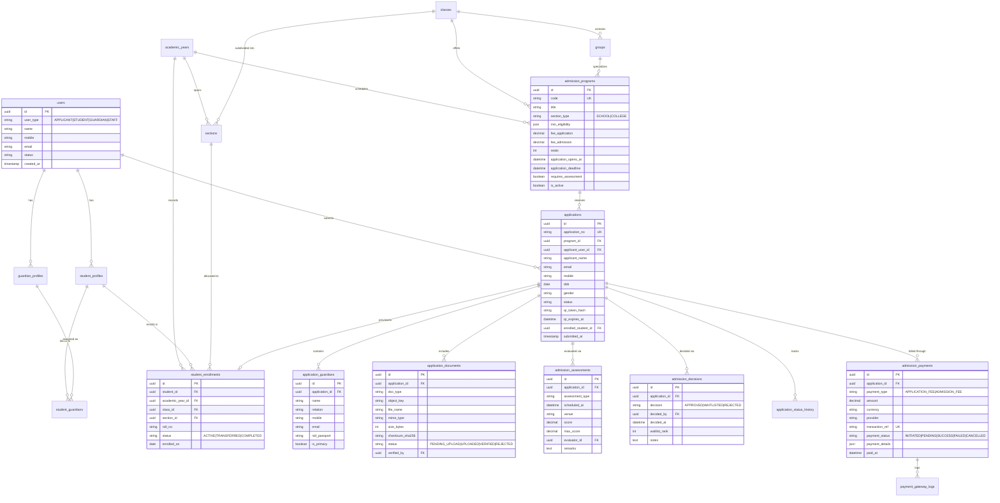

# MCC–Hello Future Admission Engine: Entity-Relationship Diagram

```mermaid
erDiagram
    users ||--o{ student_profiles : "has"
    users ||--o{ guardian_profiles : "has"
    users ||--o{ applications : "submits"
    
    student_profiles ||--o{ student_guardians : "linked to"
    guardian_profiles ||--o{ student_guardians : "assigned as"
    
    academic_years ||--o{ admission_programs : "schedules"
    academic_years ||--o{ sections : "spans"
    academic_years ||--o{ student_enrollments : "records"
    
    classes ||--o{ groups : "contains"
    classes ||--o{ sections : "subdivided into"
    classes ||--o{ admission_programs : "offers"
    groups ||--o{ admission_programs : "specializes"
    
    admission_programs ||--o{ applications : "receives"
    
    applications ||--o{ application_guardians : "contains"
    applications ||--o{ application_documents : "includes"
    applications ||--o{ admission_assessments : "evaluated via"
    applications ||--o{ admission_decisions : "decided via"
    applications ||--o{ application_status_history : "tracks"
    applications ||--o{ admission_payments : "billed through"
    
    admission_payments ||--o{ payment_gateway_logs : "logs"
    
    student_profiles ||--o{ student_enrollments : "enrolls in"
    sections ||--o{ student_enrollments : "allocated to"
    applications ||--o| student_enrollments : "provisions"

    users {
        uuid id PK
        string user_type "APPLICANT|STUDENT|GUARDIAN|STAFF"
        string name
        string mobile
        string email
        string status
        timestamp created_at
    }

    admission_programs {
        uuid id PK
        string code UK
        string title
        string section_type "SCHOOL|COLLEGE"
        json min_eligibility
        decimal fee_application
        decimal fee_admission
        int seats
        datetime application_opens_at
        datetime application_deadline
        boolean requires_assessment
        boolean is_active
    }

    applications {
        uuid id PK
        string application_no UK
        uuid program_id FK
        uuid applicant_user_id FK
        string applicant_name
        string email
        string mobile
        date dob
        string gender
        string status
        string qr_token_hash
        datetime qr_expires_at
        uuid enrolled_student_id FK
        timestamp submitted_at
    }

    application_guardians {
        uuid id PK
        uuid application_id FK
        string name
        string relation
        string mobile
        string email
        string nid_passport
        boolean is_primary
    }

    application_documents {
        uuid id PK
        uuid application_id FK
        string doc_type
        string object_key
        string file_name
        string mime_type
        int size_bytes
        string checksum_sha256
        string status "PENDING_UPLOAD|UPLOADED|VERIFIED|REJECTED"
        uuid verified_by FK
    }

    admission_assessments {
        uuid id PK
        uuid application_id FK
        string assessment_type
        datetime scheduled_at
        string venue
        decimal score
        decimal max_score
        uuid evaluator_id FK
        text remarks
    }

    admission_decisions {
        uuid id PK
        uuid application_id FK
        string decision "APPROVED|WAITLISTED|REJECTED"
        uuid decided_by FK
        datetime decided_at
        int waitlist_rank
        text notes
    }

    admission_payments {
        uuid id PK
        uuid application_id FK
        string payment_type "APPLICATION_FEE|ADMISSION_FEE"
        decimal amount
        string currency
        string provider
        string transaction_ref UK
        string payment_status "INITIATED|PENDING|SUCCESS|FAILED|CANCELLED"
        json payment_details
        datetime paid_at
    }

    student_enrollments {
        uuid id PK
        uuid student_id FK
        uuid academic_year_id FK
        uuid class_id FK
        uuid section_id FK
        string roll_no
        string status "ACTIVE|TRANSFERRED|COMPLETED"
        date enrolled_on
    }
```

